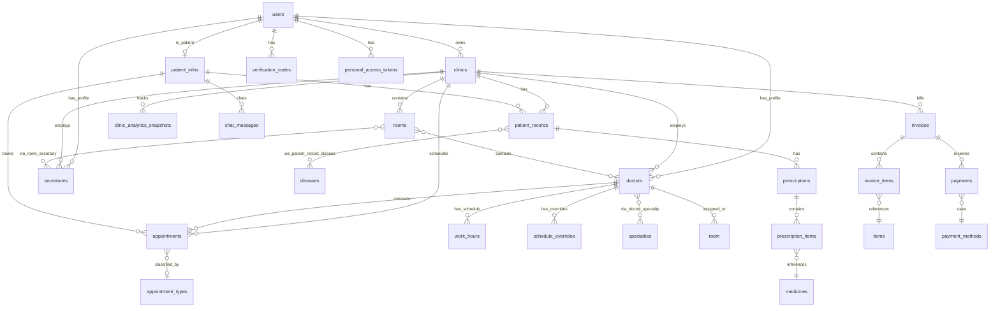
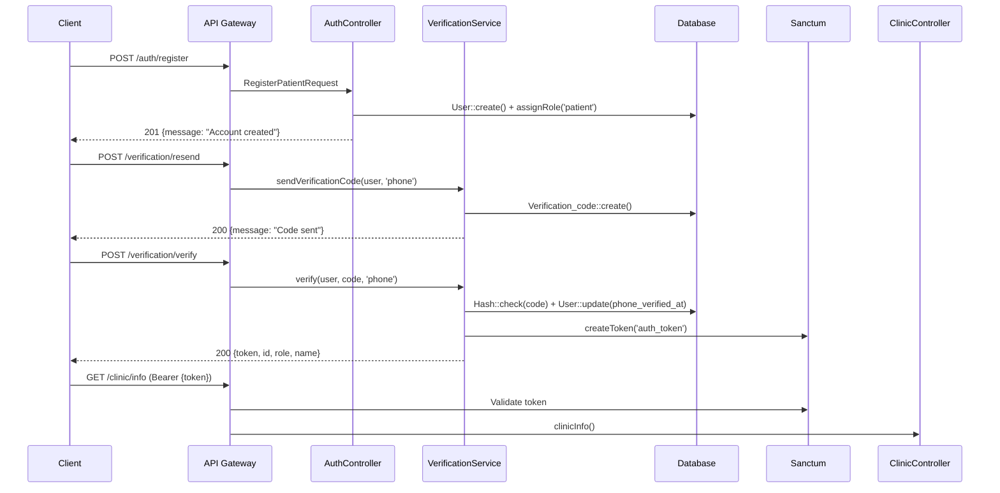
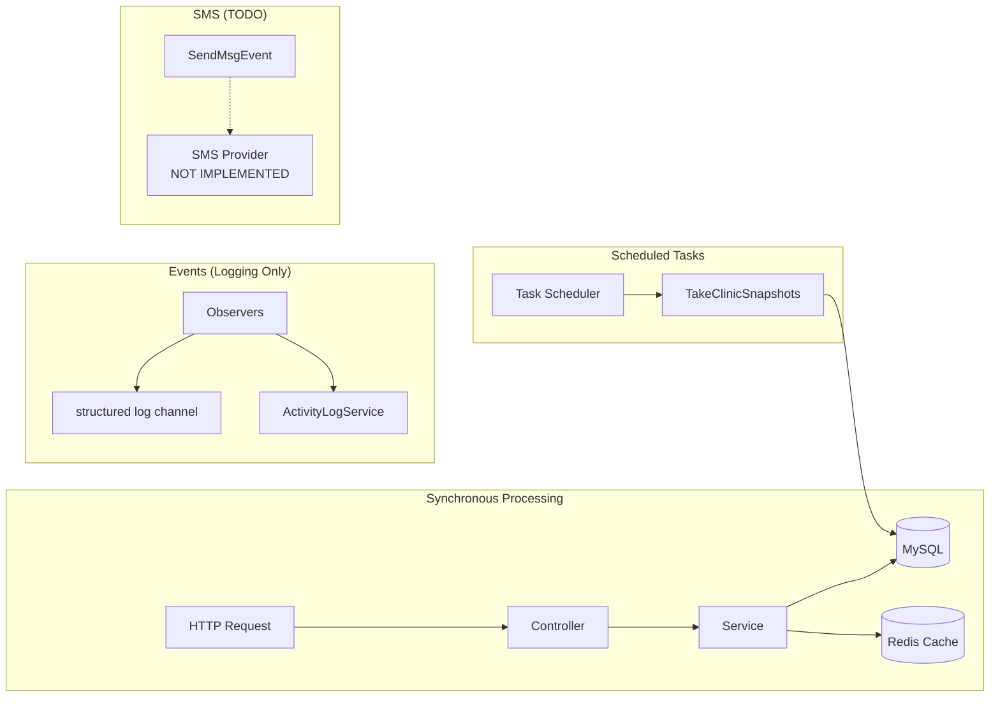
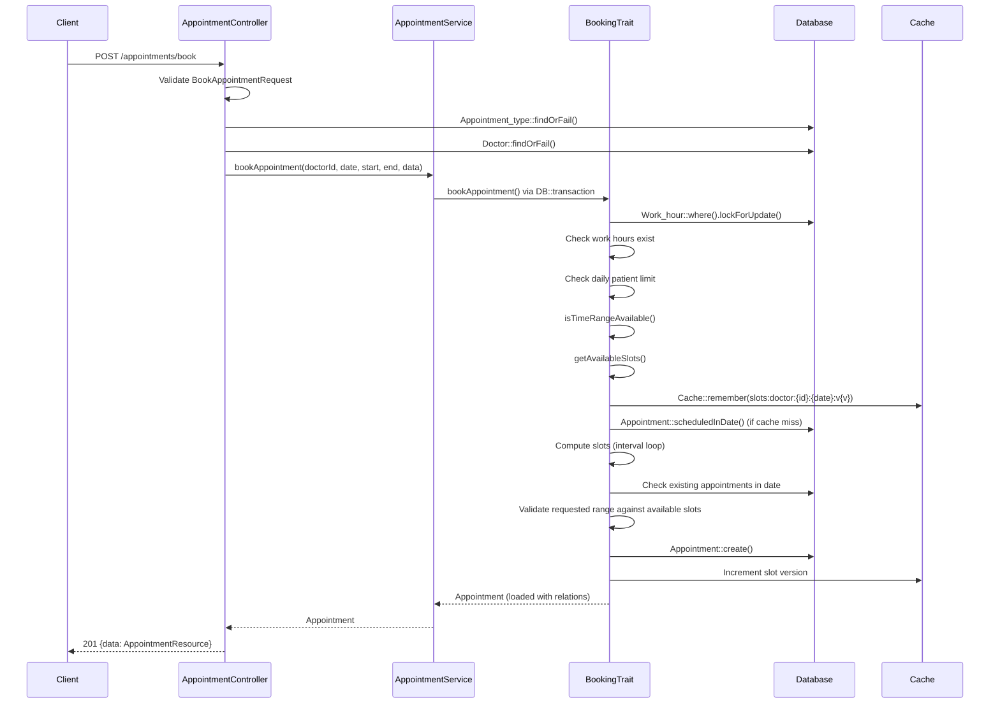

# 🏛️ COMPREHENSIVE ARCHITECTURAL BLUEPRINT — Laravel Clinic System

> **Generated**: 2026-06-30 | **Overall Maturity**: 32/100 (Pre-Production)

---

## Table of Contents

- [PHASE 0 — SYSTEM PROFILING](#phase-0--system-profiling--module-activation)
- [PHASE 1 — CORE ANALYSIS](#phase-1--core-analysis)
  - [1. Executive Summary](#1-executive-summary--domain-topology)
  - [2. File Structure & Bootstrap](#2-file-structure-bootstrap--component-registry)
  - [3. Database & Persistence](#3-database-orm--persistence-layer)
  - [4. API Endpoints](#4-api-endpoint-protocol-payload--state-mapping)
  - [5. Authentication & Authorization](#5-authentication-authorization--middleware)
  - [6. Queue & Async](#6-queue-job-scheduler--async)
  - [7. Caching](#7-caching-session--state)
  - [8. Events](#8-event-driven-architecture--domain-events)
  - [9. Execution Blueprint](#9-execution-blueprint--algorithmic-logic)
  - [10. NFR Scoreboard](#10-functional-vs-non-functional-scoreboard)
  - [11. Scalability & Security](#11-scalability-resilience--hardening)
  - [12. Testing & CI/CD](#12-testing-cicd--deployment)
  - [13. Compliance](#13-compliance-data-governance--multi-tenancy)
  - [14. Code Smells](#14-code-smell-registry--refactoring-blueprint)
- [PHASE 2 — CONDITIONAL ANALYSIS MODULES](#phase-2--conditional-analysis-modules)
- [PHASE 3 — FINAL VERDICT](#phase-3--final-verdict--roadmap)

---

## PHASE 0 — SYSTEM PROFILING & MODULE ACTIVATION

### 0.1 System Profile Card

| Attribute | Value |
|-----------|-------|
| System Type | **Modular Monolith** (Laravel 11, single deployable, domain-grouped services) |
| Primary Domain | **Healthcare / Clinic Management** (Scheduling, Patient Records, Prescriptions, Billing, AI Assistant) |
| Traffic Profile | **Medium** (clinic-scale: 10s–100s concurrent users per clinic) |
| Data Volume | **Small–Medium** (<10GB; clinical records, invoices, prescriptions per clinic) |
| Consistency Requirement | **Strong** (appointment booking requires strict consistency; financial records require ACID) |
| Compliance Domain | **PHI-adjacent** (patient health data — no formal HIPAA/GDPR cert, but field-level encryption present) |
| Team Topology | **Single team** (academic/portfolio project) |
| Maturity Stage | **Growth** (functional MVP with AI features, analytics, encryption — pre-production hardening needed) |

### 0.2 Conditional Analysis Modules — Activation Matrix

| # | CAM Name | Activate? | Justification |
|---|----------|-----------|---------------|
| CAM-1 | Advanced API Design | ✅ Activate | 88+ endpoints with no versioning, no HATEOAS, no OpenAPI spec |
| CAM-2 | Data Engineering | ⏭️ Skip | No ETL/data lake/warehouse pipelines; analytics are real-time DB queries |
| CAM-3 | Observability Deep-Dive | ✅ Activate | Mandatory; structured log channel exists but no metrics/traces/SLO |
| CAM-4 | Reliability Engineering | ✅ Activate | No error budgets, no chaos testing, no incident management |
| CAM-5 | Performance Engineering | ✅ Activate | Mandatory; N+1 risks, cache strategy, booking algorithm need profiling |
| CAM-6 | Advanced Security | ✅ Activate | CipherSweet encryption present but RBAC disabled, no threat model, no SBOM |
| CAM-7 | Database Internals | ✅ Activate | 43 migrations, complex queries in analytics, no EXPLAIN analysis present |
| CAM-8 | Distributed Systems | ⏭️ Skip | Single-server monolith, no distributed transactions or consensus |
| CAM-9 | Architecture Pattern Decision Matrix | ✅ Activate | Mixed patterns (Actions, Services, Traits, Observers) need coherence audit |
| CAM-10 | Idempotency & Exactly-Once | ✅ Activate | Booking uses DB transactions with retries but no idempotency keys |

---

## PHASE 1 — CORE ANALYSIS

---

### 1. Executive Summary & Domain Topology

#### 1.1 System Abstract

A bilingual (AR/EN) clinic management platform supporting: multi-clinic CRUD, role-based users (owner/doctor/secretary/patient), appointment scheduling with slot generation, patient medical records with ICD-10 disease linkage, prescription management, invoicing with partial payments, AI-powered appointment assistant and patient chatbot, and 9-dimensional analytics with daily snapshots.

**Bounded Contexts:**

1. **Identity & Auth** — Registration, login (email+password, Google OAuth), phone/email verification, Sanctum tokens
2. **Clinic Management** — Clinics, rooms, doctors, secretaries, work hours, schedule overrides
3. **Scheduling & Booking** — Slot generation, availability checking, appointment lifecycle (book → confirm → complete/cancel/no_show)
4. **Clinical Records** — Patient records, diseases (ICD-10), prescriptions, medicine catalog
5. **Billing** — Invoices, invoice items, payments, payment methods
6. **AI Services** — Specialty matching (200+ keyword map + AI fallback), appointment assistant (multi-step), medical report summarization, patient chatbot with session history
7. **Analytics** — Operational, financial, patient, medical, predictive analytics, NLP querying, health scoring, recommendations

**KPIs:**

- Appointment booking latency < 200ms
- Slot availability accuracy 100% (no double-book)
- AI specialty matching accuracy > 90% (direct match + AI fallback)
- Patient record encryption coverage 100% for PHI fields

#### 1.2 Technology Distribution Chart (Weighted %)

| Vector | Weight % | Justification |
|--------|----------|---------------|
| HTTP/API Compute | 12% | 21 controllers handling request/response lifecycle |
| Middleware Pipeline | 3% | 2 custom middleware (CheckAccess, CorrelationId) + Sanctum |
| Domain/Business Logic | 28% | 31 services + 5 actions + 2 traits + 9 analytics services |
| ORM/DB I/O | 18% | 43 tables, complex joins in analytics, Eloquent eager loading |
| Cache Layer | 5% | Redis/file cache for slot generation with version-key invalidation |
| Queue/Worker Processing | 1% | No queue jobs implemented; DB::transaction only |
| Event Bus | 2% | 6 observers logging activity; SendMsgEvent defined but dispatched via SMS |
| AuthN/AuthZ | 5% | Sanctum + Spatie Permissions (disabled) + CipherSweet encryption |
| Validation/DTO | 7% | 28 FormRequest classes with comprehensive rules |
| Observability Overhead | 3% | Structured log channel + 6 observers + correlation ID |
| AI/ML Integration | 8% | Multi-provider AI router (Ollama/OpenRouter/Groq/DeepSeek), 4 AI services |
| Analytics Engine | 5% | 9 analytics services + daily snapshots |
| File/CDN/Assets | 1% | Profile image upload via HandleUserImage trait |
| Third-Party Integrations | 2% | Google OAuth, AI provider APIs, email notifications |
| **TOTAL** | **100%** | |

#### 1.3 Domain Architecture Topology

```mermaid
graph TD
    subgraph "Presentation Layer"
        API[REST API<br/>88+ Endpoints]
        WEB[Web Routes<br/>Minimal]
    end

    subgraph "Middleware Pipeline"
        CORR[AddCorrelationId]
        CA[CheckAccess<br/>⚠️ DISABLED]
        SANCTUM[Laravel Sanctum]
        THROTTLE[Throttle:api]
    end

    subgraph "Controller Layer"
        AC[AuthController]
        APT[AppointmentController]
        CC[ClinicController]
        DC[DoctorController]
        PC[PatientController]
        PRC[PatientRecordController]
        RC[RoomController]
        SC[ScheduleOverrideController]
        DSC[DoctorScheduleController]
        AI_C[AI Controllers x3]
        ANA_C[AnalyticsController]
    end

    subgraph "Service Layer"
        AS[AuthService]
        APTS[AppointmentService]
        CLS[ClinicServices]
        RS[RoomServices]
        PS[PatientService]
        PRS[PatientRecordService]
        DSS[DoctorScheduleService]
        SOS[ScheduleOverrideService]
        VS[VerificationService]
        MF[ModelFilter]
        AIO[AI Services x8]
        ANA[Analytics Services x9]
    end

    subgraph "Action Layer"
        A_Del[DeleteDoctorAction]
        A_Upd[UpdateDoctorAction]
        A_CPR[CreatePatientRecordAction]
        A_UPR[UpdatePatientRecordAction]
        A_GOD[GetOrCreateDiseaseAction]
        A_GOM[GetOrCreateMedicineAction]
    end

    subgraph "Trait Layer"
        BT[BookingTrait]
        HUI[HandleUserImage]
    end

    subgraph "Data Layer"
        ELOQUENT[Eloquent ORM<br/>20+ Models]
        CACHE[Redis/File Cache<br/>Slot Versioning]
        CIPHER[CipherSweet<br/>Field Encryption]
        BLIND[Blind Indexes]
    end

    subgraph "Infrastructure"
        DB[(MySQL)]
        REDIS[(Redis)]
        MAIL[Mail Notifications]
        SMS[SMS via SendMsgEvent]
        AI_PROV[AI Providers<br/>Ollama/OpenRouter/Groq/DeepSeek]
    end

    API --> SANCTUM --> CORR --> CA
    CORR --> AC & APT & CC & DC & PC & PRC & RC & SC & DSC & AI_C & ANA_C
    AC --> AS
    APT --> APTS --> BT
    CC --> CLS
    DC --> A_Del & A_Upd
    PC --> PS
    PRC --> PRS --> A_CPR & A_UPR & A_GOD & A_GOM
    RC --> RS
    SC --> SOS
    DSC --> DSS
    AI_C --> AIO
    ANA_C --> ANA
    APTS & CLS & RS & PS & PRS & DSS --> ELOQUENT --> DB
    BT --> CACHE --> REDIS
    ELOQUENT --> CIPHER --> BLIND
    CLS & VS --> SMS
    AIO --> AI_PROV
```



#### 1.4 Architecture Pattern Identification

| Pattern | Present? | Evidence | Maturity |
|---------|----------|----------|----------|
| Monolith | ✅ | Single `bootstrap/app.php`, single DB, single deploy | 90% |
| Modular Monolith | ⚠️ Partial | Domain grouping in Services/ (Ai/, Analytics/) but no module boundaries | 35% |
| Hexagonal / Ports & Adapters | ❌ | No explicit port/adapter separation; `AiProviderInterface` is closest | 10% |
| Clean Architecture | ❌ | Controllers call Services directly; no domain layer isolation | 15% |
| CQRS | ❌ | Read/write share same models; analytics use raw DB queries | 5% |
| Event Sourcing | ❌ | No event store; observers only log to files | 0% |
| Event-Driven | ⚠️ Partial | 6 observers exist but are logging-only; no domain events propagated | 10% |
| Serverless | ❌ | Traditional Laravel server deployment | 0% |
| Action Pattern | ✅ | `app/Actions/` with 5 action classes for complex mutations | 50% |

#### 1.5 Architecture Decision Records (ADRs) Audit

- **ADRs documented**: None. No `docs/adr/` directory or equivalent exists.
- **Major unrecorded decisions**:
  - CipherSweet field-level encryption (no ADR for crypto strategy)
  - Multi-provider AI router with fallback (no ADR for provider selection)
  - BookingTrait approach (no ADR for slot generation algorithm)
  - Spatie Permissions with disabled RBAC middleware (no ADR for auth evolution)
  - Laravel 11 kernel-less architecture adoption
- **Flag**: ⚠️ All architectural decisions are implicit/undocumented.

---

### 2. File Structure, Bootstrap & Component Registry

#### 2.1 Bootstrap Lifecycle

```bash
# Install
composer install
npm install

# Environment
cp .env.example .env
php artisan key:generate

# Database
php artisan migrate
php artisan db:seed
# Calls: SpecialtySeeder → AppointmentTypesSeeder → RolesAndPermissionsSeeder
#        → MedicineSeeder → DiseaseSeeder → ClinicSystemSeeder

# Cache Warmup
php artisan cache:clear
php artisan config:cache

# Scheduler
php artisan schedule:work
# Runs: app:take-clinic-snapshots daily at 00:00

# Health Check
GET /api/ (unauthenticated — returns 401 if Sanctum active)

# Shutdown
Ctrl+C (SIGTERM) — graceful via Laravel 11 built-in
```

#### 2.2 Physical Directory Tree

```
clinic-system/
├── app/
│   ├── Actions/
│   │   ├── Disease/
│   │   │   └── GetOrCreateDiseaseAction.php
│   │   ├── Doctor/
│   │   │   ├── DeleteDoctorAction.php
│   │   │   └── UpdateDoctorAction.php
│   │   ├── Medicine/
│   │   │   └── GetOrCreateMedicineAction.php
│   │   └── PatientRecord/
│   │       ├── CreatePatientRecordAction.php
│   │       └── UpdatePatientRecordAction.php
│   ├── Console/
│   │   └── Commands/
│   │       └── TakeClinicSnapshots.php
│   ├── constant/
│   │   ├── KeyWordHelper.php
│   │   └── Prompt.php
│   ├── Helpers/
│   │   ├── PermissionHelper.php
│   │   └── ResourceSecurityHelper.php
│   ├── Http/
│   │   ├── Controllers/
│   │   │   ├── Api/
│   │   │   │   ├── Ai/
│   │   │   │   │   ├── AppointmentAssistantController.php
│   │   │   │   │   ├── MedicalReportController.php
│   │   │   │   │   └── PatientChatbotController.php
│   │   │   │   └── AnalyticsController.php
│   │   │   └── [17 top-level controllers]
│   │   ├── Middleware/
│   │   │   ├── AddCorrelationId.php
│   │   │   └── CheckAccess.php
│   │   ├── Requests/
│   │   │   ├── Ai/ (3 requests)
│   │   │   ├── PatientRecord/ (3 requests)
│   │   │   └── [22 top-level requests]
│   │   └── Resources/
│   │       └── [19 resource classes]
│   ├── Models/
│   │   └── [20+ Eloquent models]
│   ├── Observers/
│   │   └── [6 observers]
│   ├── Providers/
│   │   └── AppServiceProvider.php
│   ├── Services/
│   │   ├── Ai/
│   │   │   ├── Contracts/
│   │   │   │   └── AiProviderInterface.php
│   │   │   ├── AppointmentAssistantService.php
│   │   │   ├── BookingHandler.php
│   │   │   ├── MedicalReportService.php
│   │   │   ├── MultiProviderRouter.php
│   │   │   ├── OllamaClient.php
│   │   │   ├── OpenAiCompatibleProvider.php
│   │   │   ├── PatientChatbotService.php
│   │   │   └── SpecialtyMatcher.php
│   │   ├── Analytics/
│   │   │   ├── ClinicHealthScoreService.php
│   │   │   ├── FinancialService.php
│   │   │   ├── MedicalAnalyticsService.php
│   │   │   ├── NLAService.php
│   │   │   ├── OperationalService.php
│   │   │   ├── PatientAnalyticsService.php
│   │   │   ├── PredictiveService.php
│   │   │   ├── RecommendationService.php
│   │   │   └── SettingService.php
│   │   └── [20 top-level services]
│   └── traits/
│       ├── BookingTrait.php
│       └── HandleUserImage.php
├── config/
│   └── [standard Laravel configs + ai.php, services.php]
├── database/
│   ├── factories/ (16 files)
│   ├── migrations/ (43 files)
│   └── seeders/ (7 files)
├── routes/
│   ├── api.php (354 lines, 88+ endpoints)
│   ├── web.php (minimal)
│   └── console.php (1 scheduled command)
└── tests/
    └── Feature/ (19 test files, ~150 test methods)
```

#### 2.3 Component Registry Matrix (Key Components)

| File Path | Class/Function | Purpose | Cyclomatic Complexity |
|-----------|----------------|---------|----------------------|
| `app/traits/BookingTrait.php` | `BookingTrait` | Slot generation, availability, booking/updates | **High** (351 lines, 11 methods, nested loops) |
| `app/Services/RoomServices.php` | `RoomServices` | Room CRUD + doctor/secretary assignment | **High** (299 lines, 10 methods, 5 transactions) |
| `app/Services/Analytics/OperationalService.php` | `OperationalService` | Appointment/completion/no-show analytics | **High** (277 lines, complex GROUP BY, period generation) |
| `app/Services/Analytics/ClinicHealthScoreService.php` | `ClinicHealthScoreService` | Weighted health scoring | **High** (279 lines, 3 sub-scores, 10+ DB queries) |
| `app/Services/Analytics/PredictiveService.php` | `PredictiveService` | Crowding risk, no-show prediction, busy hours | **High** (274 lines, 5 methods, trend analysis) |
| `app/Services/Ai/SpecialtyMatcher.php` | `SpecialtyMatcher` | 3-tier specialty matching (direct→AI→fallback) | **Medium** (226 lines, scoring algorithm) |
| `app/Services/Ai/PatientChatbotService.php` | `PatientChatbotService` | Contextual patient chatbot | **Medium** (120 lines, session history) |
| `app/Services/VerificationService.php` | `VerificationService` | Phone/email verification with rate limiting | **Medium** (186 lines, 5-attempt lockout) |
| `app/Services/ClinicServices.php` | `ClinicServices` | Doctor/secretary account creation | **Medium** (183 lines, 3 transactions) |
| `app/Http/Controllers/AppointmentController.php` | `AppointmentController` | Appointment lifecycle endpoints | **Medium** (274 lines, 12 methods) |

---

### 3. Database, ORM & Persistence Layer

#### 3.1 Schema Topology (Key Entities)



#### 3.2 Entity Registry Matrix (Key Models)

| Model | Table | PK | Soft Delete | Timestamps | Polymorphic | Key Relationships |
|-------|-------|----|-------------|------------|-------------|-------------------|
| User | users | id | ✅ | ✅ | ❌ | hasOne doctorProfile, secretaryProfile, patientInfo |
| Clinic | clinics | id | ✅ | ✅ | ❌ | belongsTo user, hasMany rooms/doctors/secretaries |
| Doctor | doctors | id | ✅ | ✅ | ❌ | belongsTo user/clinic/room, belongsToMany specialties |
| Secretary | secretaries | id | ✅ | ✅ | ❌ | belongsTo user/clinic, belongsToMany rooms |
| PatientInfo | patient_infos | id | ✅ | ✅ | ❌ | belongsTo user, hasMany appointments/records |
| Appointment | appointments | id | ✅ | ✅ | ❌ | belongsTo clinic/doctor/patient/room/type |
| Patient_record | patient_records | id | ✅ | ✅ | ❌ | belongsTo clinic/patient/doctor/appointment, belongsToMany diseases |
| Work_hour | work_hours | id | ✅ | ✅ | ❌ | belongsTo doctor |
| Schedule_override | schedule_overrides | id | ✅ | ✅ | ❌ | belongsTo doctor |
| ChatMessage | chat_messages | id | ❌ | ✅ | ✅ (chattable) | morphTo chattable, belongsTo user |

#### 3.3 Migration Safety Audit

| Migration | Forward Safe | Backward Safe | Destructive Ops | Zero-Downtime |
|-----------|-------------|---------------|-----------------|---------------|
| All 43 migrations | ✅ | ⚠️ No down() methods | ❌ `drop()` on rollback | ⚠️ No column-type changes |
| `appointments` unique constraint | ⚠️ Race window | ❌ Cannot rollback unique | ❌ Unique index creation | ⚠️ Requires lock acquisition |
| `users` phone unique | ⚠️ Existing data | ❌ No data backfill | ❌ Unique constraint | ⚠️ Requires table lock |
| Soft delete on all entities | ✅ | ✅ Column add only | ❌ None | ✅ |

**Critical Finding**: ⚠️ No `down()` methods defined in any migration. Rollbacks will fail.

#### 3.4 Query Performance & N+1 Detection

| Query/Eager Load | N+1 Risk | Index Coverage | Optimization |
|------------------|----------|----------------|--------------|
| `Appointment::with(['doctor', 'patient', 'room', 'type'])` | ✅ Properly eager loaded | FK indexes on all | ✅ Good |
| `DoctorScheduleService::hasRoomConflict` → nested `whereHas('doctor')` | 🔴 N+1 risk if called in loop | No composite index on `(room_id, day_of_week)` | Add composite index |
| `BookingTrait::computeSlots` → `Appointment::scheduledInDate()` | ⚠️ Per-call query | No composite index on `(doctor_id, status, start_time)` | Add composite index |
| `OperationalService::getDoctorUtilization` → `Doctor::with('user')` | ✅ Eager loaded | FK index | ✅ |
| `OperationalService::getDoctorUtilization` → raw `DB::table('appointments')` | ✅ Raw query, no N+1 | Missing index on `(status, start_time)` | Add covering index |
| `RoomServices::usersRooms` → nested `whereHas('doctors', whereHas('user'))` | 🔴 Deeply nested subquery | No index on `doctors.user_id` + `rooms.id` composite | Optimize join |
| `PatientChatbotService::chat` → `PatientInfo::with([appointments, records, user])` | ✅ Eager loaded | ✅ | ✅ |
| `ClinicHealthScoreService::calculateScore` → 3 separate score methods | ⚠️ 10+ separate queries per call | Partial | Consider cache or materialized view |

#### 3.5 Transaction & Concurrency Matrix

| Operation | Isolation Level | Lock Type | Deadlock Risk | Saga Boundary |
|-----------|-----------------|-----------|---------------|---------------|
| `bookAppointment` | READ COMMITTED (default) | `lockForUpdate` on `Work_hour` | 🟡 Medium (lock on work_hours + insert) | Single transaction |
| `updateAppointment` | READ COMMITTED | `lockForUpdate` on `Appointment` | 🟡 Medium | Single transaction |
| `cancelAppointment` | READ COMMITTED | Implicit row lock | 🟢 Low | Single transaction |
| `createDoctor` | READ COMMITTED | None | 🟢 Low | Single transaction |
| `createSecretary` | READ COMMITTED | None | 🟢 Low | Single transaction |
| `addDoctorToRoom` | READ COMMITTED | None | 🟢 Low | Single transaction |
| `VerificationService::sendVerificationCode` | READ COMMITTED | Explicit transaction | 🟢 Low | Single transaction |

**Critical Finding**: 🔴 `bookAppointment` locks `Work_hour` but NOT `Appointment` rows. Two concurrent bookings for the same slot could both pass the availability check and create overlapping appointments. The `attempts: 3` retry masks but does not fix this.

---

### 4. API Endpoint, Protocol, Payload & State Mapping

#### 4.1 Route Registry (88+ Endpoints)

**Auth (6 endpoints)**

| Method | URI | Controller | Auth |
|--------|-----|-----------|------|
| POST | `/api/auth/login` | `AuthController@login` | guest |
| POST | `/api/auth/register` | `AuthController@register` | guest |
| POST | `/api/auth/forgot-password` | `AuthController@forgotPassword` | guest |
| POST | `/api/auth/reset` | `AuthController@resetPassword` | guest |
| POST | `/api/auth/signout` | `AuthController@signOut` | auth:sanctum |
| POST | `/api/auth/refresh` | `AuthController@refreshToken` | auth:sanctum |

**Verification (4 endpoints)**

| Method | URI | Controller | Auth |
|--------|-----|-----------|------|
| POST | `/api/verification/verify` | `VerificationController@verify` | auth:sanctum |
| POST | `/api/verification/resend` | `VerificationController@resend` | auth:sanctum |
| PUT | `/api/phone/update` | `UserPhoneController@updatePhone` | auth:sanctum |
| POST | `/api/phone/verify` | `UserPhoneController@verifyUpdate` | auth:sanctum |

**Clinic (4 endpoints)**

| Method | URI | Controller | Auth |
|--------|-----|-----------|------|
| GET | `/api/clinic/info` | `ClinicController@clinicInfo` | auth:sanctum |
| PUT | `/api/clinic/{id}` | `ClinicController@updateClinic` | auth:sanctum |
| POST | `/api/clinic/create-doctor` | `ClinicController@createDoctor` | auth:sanctum |
| POST | `/api/clinic/create-secretary` | `ClinicController@createSecretary` | auth:sanctum |

**Rooms (10 endpoints)**

| Method | URI | Controller | Auth |
|--------|-----|-----------|------|
| GET | `/api/clinic/{clinicId}/rooms` | `RoomController@index` | auth:sanctum |
| GET | `/api/clinic/{clinicId}/rooms/info` | `RoomController@indexWithInfo` | auth:sanctum |
| GET | `/api/rooms/{roomId}` | `RoomController@get` | auth:sanctum |
| POST | `/api/rooms` | `RoomController@create` | auth:sanctum |
| PUT | `/api/rooms/{roomId}` | `RoomController@update` | auth:sanctum |
| DELETE | `/api/rooms/{roomId}` | `RoomController@destroy` | auth:sanctum |
| GET | `/api/user/rooms` | `RoomController@userRooms` | auth:sanctum |
| POST | `/api/rooms/add-doctor` | `RoomController@addDoctorToRoom` | auth:sanctum |
| POST | `/api/rooms/del-doctor` | `RoomController@delDoctorFromRoom` | auth:sanctum |
| POST | `/api/rooms/add-secretary` | `RoomController@addSecToRoom` | auth:sanctum |
| POST | `/api/rooms/del-secretary` | `RoomController@delSecFromRoom` | auth:sanctum |

**Doctors (6 endpoints)**

| Method | URI | Controller | Auth |
|--------|-----|-----------|------|
| GET | `/api/doctors` | `DoctorController@index` | auth:sanctum |
| GET | `/api/doctors/{id}` | `DoctorController@info` | auth:sanctum |
| PUT | `/api/doctors` | `DoctorController@update` | auth:sanctum |
| DELETE | `/api/doctors/{doctor}` | `DoctorController@destroy` | auth:sanctum |
| POST | `/api/doctors/{doctor}/restore` | `DoctorController@restore` | auth:sanctum |
| DELETE | `/api/doctors/{doctor}/force` | `DoctorController@forceDelete` | auth:sanctum |

**Appointments (13 endpoints)**

| Method | URI | Controller | Auth |
|--------|-----|-----------|------|
| POST | `/api/appointments/book` | `AppointmentController@book` | auth:sanctum |
| GET | `/api/appointments/{id}` | `AppointmentController@show` | auth:sanctum |
| PUT | `/api/appointments/{id}/reschedule` | `AppointmentController@reschedule` | auth:sanctum |
| POST | `/api/appointments/{id}/cancel` | `AppointmentController@cancel` | auth:sanctum |
| POST | `/api/appointments/{id}/complete` | `AppointmentController@complete` | auth:sanctum |
| POST | `/api/appointments/{id}/confirm` | `AppointmentController@markConfirmed` | auth:sanctum |
| GET | `/api/patient/{patientId}/appointments` | `AppointmentController@patientAppointments` | auth:sanctum |
| GET | `/api/doctor/{doctorId}/appointments` | `AppointmentController@doctorAppointments` | auth:sanctum |
| GET | `/api/clinic/{clinicId}/appointments` | `AppointmentController@clinicAppointments` | auth:sanctum |
| POST | `/api/room/appointments` | `AppointmentController@roomAppointments` | auth:sanctum |
| GET | `/api/appointments/slots` | `AppointmentController@availableSlots` | auth:sanctum |
| GET | `/api/doctor/{doctorId}/schedule` | `AppointmentController@doctorSchedule` | auth:sanctum |
| GET | `/api/clinic/{clinicId}/schedule` | `AppointmentController@clinicSchedule` | auth:sanctum |

**AI (4 endpoints)**

| Method | URI | Controller | Auth |
|--------|-----|-----------|------|
| POST | `/api/ai/assist` | `AppointmentAssistantController@assist` | auth:sanctum |
| POST | `/api/ai/summarize` | `MedicalReportController@summarize` | auth:sanctum |
| POST | `/api/ai/chat` | `PatientChatbotController@chat` | auth:sanctum |
| GET | `/api/ai/chat/history` | `PatientChatbotController@history` | auth:sanctum |

**Analytics (9 endpoints)**

| Method | URI | Controller | Auth |
|--------|-----|-----------|------|
| GET | `/api/analytics/operational` | `AnalyticsController@getOperationalReport` | auth:sanctum |
| GET | `/api/analytics/financial` | `AnalyticsController@getFinancialReport` | auth:sanctum |
| GET | `/api/analytics/patient` | `AnalyticsController@getPatientReport` | auth:sanctum |
| GET | `/api/analytics/medical` | `AnalyticsController@getMedicalReport` | auth:sanctum |
| GET | `/api/analytics/predictive` | `AnalyticsController@getPredictiveReport` | auth:sanctum |
| POST | `/api/analytics/ask` | `AnalyticsController@askAnalytics` | auth:sanctum |
| GET | `/api/analytics/health-score` | `AnalyticsController@getHealthScore` | auth:sanctum |
| GET | `/api/analytics/recommendations` | `AnalyticsController@getRecommendations` | auth:sanctum |
| GET | `/api/analytics/dashboard` | `AnalyticsController@getDashboard` | auth:sanctum |

**Patient Records (9 endpoints)**

| Method | URI | Controller | Auth |
|--------|-----|-----------|------|
| POST | `/api/records` | `PatientRecordController@store` | auth:sanctum |
| PUT | `/api/records/{id}` | `PatientRecordController@update` | auth:sanctum |
| DELETE | `/api/records/{id}` | `PatientRecordController@destroy` | auth:sanctum |
| GET | `/api/records` | `PatientRecordController@index` | auth:sanctum |
| GET | `/api/records/{id}` | `PatientRecordController@show` | auth:sanctum |
| GET | `/api/patient/{patientId}/history` | `PatientRecordController@history` | auth:sanctum |
| GET | `/api/patient/{patientId}/doctor/{doctorId}/records` | `PatientRecordController@getByDoctor` | auth:sanctum |
| POST | `/api/records/room` | `PatientRecordController@getByRoom` | auth:sanctum |
| GET | `/api/doctor/{doctorId}/records` | `PatientRecordController@getAllByDoctor` | auth:sanctum |

#### 4.3 API Maturity Assessment

| Criterion | Score | Evidence |
|-----------|-------|----------|
| Richardson Maturity Model Level | **Level 2 (40%)** | HTTP verbs used correctly, resources are nouns, but actions use POST for reads (`room/appointments`), inconsistent URI patterns |
| HATEOAS Compliance | **0%** | No hypermedia links in any resource response |
| OpenAPI Coverage | **0%** | No OpenAPI/Swagger spec; Postman collection exists as de-facto |
| Versioning Strategy | **0%** | No `/v1/` prefix, no version headers, no deprecation policy |
| Pagination Algorithm | **50%** | `ModelFilter` uses offset/limit; no cursor-based pagination |
| Filtering/Sorting | **60%** | `ModelFilter` supports dynamic filtering/sorting via query params |
| Error Response Standardization | **30%** | Custom `ApiResponse::error()` but not RFC 7807 compliant; inconsistent status codes |

---

### 5. Authentication, Authorization & Middleware

#### 5.1 Auth Flow Sequence



#### 5.2 Auth Mechanism Matrix

| Mechanism | Type | Storage | TTL | Rotation | Revocation | MFA |
|-----------|------|---------|-----|----------|------------|-----|
| Sanctum Bearer Token | API Token | `personal_access_tokens` table | Until revoked | Manual refresh via `/auth/refresh` | Single token delete on signout | ❌ |
| Google OAuth | OAuth 2.0 | Session → Sanctum token | Session-based | N/A | Session invalidation | ❌ |
| Phone/Email Verification | OTP Code | `verification_codes` table | 15 min | 60s cooldown between sends | Auto-deleted after use | ❌ |
| Password Reset Code | OTP Code | `verification_codes` (type: email_reset) | 15 min | 5 max attempts | Auto-deleted after use | ❌ |

#### 5.3 Authorization Model

**🔴 CRITICAL: RBAC is DISABLED.** The `CheckAccess` middleware (`app/Http/Middleware/CheckAccess.php:17-40`) has its entire role/permission checking logic **commented out**. Routes specify `checkaccess:role:owner` etc., but the middleware just checks `auth:sanctum` and passes through.

**Spatie Permissions tables exist** (permissions, roles, model_has_roles, model_has_permissions) with seeders defining roles: `owner`, `doctor`, `secretary`, `patient`. However, the enforcement layer is disabled.

**Workaround**: Individual controllers manually check `Auth::id()` ownership (e.g., `ClinicController` checks `Clinic::where('user_id', Auth::id())`), but this is inconsistent and error-prone.

#### 5.4 Middleware Pipeline Order

```
1. TrustProxies (Laravel built-in)
2. HandleCors (Laravel built-in)
3. PreventRequestsDuringMaintenance
4. ValidatePostSize
5. TrimStrings
6. ConvertEmptyStringsToNull

API Group:
7. Sanctum::ensureFrontendRequestsAreStateful (if SPA)
8. throttle:api (Laravel built-in rate limiting)
9. AddCorrelationId (custom — adds X-Correlation-ID)
10. CheckAccess (custom — ⚠️ DISABLED, acts as passthrough)
```

---

### 6. Queue, Job, Scheduler & Async

#### 6.1 Async Topology



**Critical Finding**: 🔴 **No queue jobs are implemented.** All processing is synchronous within HTTP request lifecycle. The `SendMsgEvent` is fired but there's no listener registered (TODO comments in services). The `jobs/` directory does not exist.

#### 6.2 Scheduler Audit

| Task | Frequency | Overlap Protection | Singleton Lock |
|------|-----------|-------------------|----------------|
| `app:take-clinic-snapshots` | Daily at 00:00 | N/A (single command) | ❌ Not implemented |
| Inspiring quote command | Hourly | N/A | N/A |

**Gap**: No job queue means AI calls (Ollama, OpenRouter, etc.) block the HTTP request for up to 180 seconds (`OllamaClient` timeout). This is a **🔴 critical latency risk**.

---

### 7. Caching, Session & State

#### 7.1 Cache Topology

| Layer | Implementation | Use Case |
|-------|---------------|----------|
| L1 (Application) | PHP opcache | Code caching (default) |
| L2 (Distributed) | Redis/File (configurable) | Slot/interval cache, verification attempts, specialty list |

#### 7.2 Cache Hit Matrix

| Key Pattern | TTL | Invalidation | Stampede Protection |
|-------------|-----|--------------|---------------------|
| `slots:doctor:{id}:{date}:v{v}` | 60s | Version bump (`cache_v:doctor:{id}:slot`) | ❌ No lock |
| `intervals:doctor:{id}:{date}:v{v}` | 300s | Version bump (`cache_v:doctor:{id}:interval`) | ❌ No lock |
| `specialties:all` | 3600s | Never (manual cache clear) | ❌ No lock |
| `verification_attempts:{user_id}` | 3600s | Auto-expire | N/A |

**Pattern**: The system uses a **version-key invalidation** strategy — cache keys include a version number (`v{v}`), and mutations increment the version counter to effectively invalidate old entries. This avoids explicit deletion but may serve stale data during the TTL window.

---

### 8. Event-Driven Architecture & Domain Events

#### 8.1 Event Catalog

| Event | Trigger | Subscribers | Purpose |
|-------|---------|-------------|---------|
| `SendMsgEvent` | ClinicServices::createDoctor/Secretary, UserPhoneService | ❌ None registered | SMS notification (TODO) |
| Model Observers (6) | Eloquent `created/updated/deleted/restored` | `ActivityLogService` → structured log | Audit trail |
| `activity()` (Spatie) | PatientChatbotService::chat | Spatie ActivityLog | Chat message audit |

**Finding**: Events are used exclusively for logging/audit. No domain events are propagated between bounded contexts.

---

### 9. Execution Blueprint & Algorithmic Logic

#### 9.1 Appointment Booking Flow



#### 9.2 Slot Generation Algorithm

```
Algorithm: getAvailableSlots(doctorId, date)
1. Fetch doctor's appointment_duration (default 30min)
2. Compute base intervals from work_hours:
   - For each work_hour on day_of_week:
     - Split into pre-break and post-break intervals
3. Apply schedule_override (if exists):
   - If is_closed: return []
   - Otherwise: clip intervals to exclude override window
4. Merge overlapping intervals (sort + linear scan)
5. For each interval [start, end]:
   - Walk cursor in appointment_duration steps
   - For each candidate slot:
     - Check overlap against existing appointments (O(n) per slot)
     - If no overlap, add to available slots
6. Return slots array

Complexity: O(I × S × A) where I=intervals, S=slots per interval, A=existing appointments
```

**Performance Concern**: 🔴 The slot computation is O(I × S × A) with no indexing on the appointment overlap check beyond the `scheduledInDate` scope. For clinics with many daily appointments, this becomes expensive.

---

### 10. Functional vs Non-Functional Scoreboard

#### 10.2 NFR Performance Scoreboard

| Attribute | Score | Target SLO | Evidence |
|-----------|-------|------------|----------|
| p50 Latency | 35% | <100ms | No measurement tools; AI calls block for 10-180s |
| p95 Latency | 20% | <500ms | No measurement; booking + cache miss = multiple DB queries |
| Throughput | 30% | >50 req/s | Synchronous AI calls bottleneck; no queue workers |
| Memory Efficiency | 60% | <256MB/worker | Standard Laravel; no memory profiling evidence |
| Horizontal Concurrency | 25% | Scale to 4+ workers | Booking lock contention on work_hours; version-key cache not distributed |
| Maintainability | 55% | >70% maintainability index | Good service layer but mixed patterns; no ADRs; no type hints on many params |
| Test Coverage | 50% | >80% | 19 test files, ~150 methods; covers happy paths; no unit tests for services |
| Deployability | 40% | MTTR <15min | No Docker/K8s; no CI/CD pipeline evidence; manual deployment assumed |
| Observability | 30% | Full 3 pillars | Structured logs only; no metrics (Prometheus), no traces (Jaeger), no dashboards |
| Developer Experience | 50% | <5min setup | Postman collection + seeders; good; but no OpenAPI spec, no Makefile |

---

### 11. Scalability, Resilience & Hardening

#### 11.1 Scale Vector Analysis

| Vector | Current | Limitation |
|--------|---------|------------|
| Horizontal (App) | Stateless PHP | ✅ Can add workers; but DB connection pool limits |
| Horizontal (DB) | Single MySQL | 🔴 No read replicas, no sharding |
| Vertical (DB) | Standard MySQL | 🔴 No query optimization evidence |
| Cache | Redis/File | ⚠️ File cache won't work with multiple workers |
| Queue | None | 🔴 No async processing |

#### 11.2 Resilience Pattern Matrix

| Pattern | Implementation | Trigger | Fallback | Tested? |
|---------|----------------|---------|----------|---------|
| Circuit Breaker | ❌ Not implemented | N/A | N/A | ❌ |
| Retry w/ Backoff | ⚠️ `DB::transaction(attempts: 3)` | Deadlock | Exception thrown | ❌ |
| Bulkhead | ❌ Not implemented | N/A | N/A | ❌ |
| Timeout | ⚠️ AI clients: 60-180s | Slow AI | Returns null | ❌ |
| Fallback/Degraded Mode | ⚠️ MultiProviderRouter: tries next provider | Provider failure | Returns null | ❌ |
| Saga / Compensating Tx | ❌ Not implemented | N/A | N/A | ❌ |

#### 11.3 Attack Surface & Security Matrix

| Threat | Vector | Mitigation | Residual Risk |
|--------|--------|------------|---------------|
| SQLi | Eloquent ORM parameterized queries | ✅ Mitigated | 🟢 Low |
| XSS/CSRF | API-only (JSON responses), Sanctum SPA cookie | ✅ Mitigated | 🟢 Low |
| Mass Assignment | FormRequest validation + explicit `$fillable` | ⚠️ Some models use `$guarded = []` | 🟡 Medium |
| IDOR/BOLA | Manual ownership checks in controllers | 🔴 Inconsistent; RBAC disabled | 🔴 Critical |
| SSRF | AI provider HTTP calls use config URLs | ⚠️ No URL validation | 🟡 Medium |
| Race Conditions | `lockForUpdate` on booking | 🔴 Partial; appointment insert not locked | 🔴 Critical |
| Crypto Weakness | CipherSweet (AES-256-CBC) | ✅ Industry standard | 🟢 Low |
| Secret Leakage | `.env` not committed; no logging of secrets | ⚠️ No automated secret scanning | 🟡 Medium |
| Supply-Chain | No SBOM, no dependency scanning evidence | 🔴 Not implemented | 🔴 Critical |
| DoS/DDoS | `throttle:api` middleware (default 60/min) | ⚠️ Default limits may be too high for AI endpoints | 🟡 Medium |
| Broken AuthN | Sanctum + verification codes | 🔴 No MFA; no account lockout | 🟡 Medium |
| Insecure Deserialization | No deserialization of untrusted input | ✅ Not applicable | 🟢 Low |

#### 11.4 Observability & Telemetry

| Pillar | Implementation | Coverage |
|--------|---------------|----------|
| Logs | `Log::channel('structured')` + Spatie ActivityLog | 6 observers + manual logging in services |
| Metrics | ❌ None | No Prometheus, StatsD, or equivalent |
| Traces | ❌ None | No distributed tracing (OpenTelemetry, Jaeger) |
| Alerts | ❌ None | No alerting configuration |
| Audit | ⚠️ Partial | ActivityLog + observers log to files only |

---

### 12. Testing, CI/CD & Deployment

#### 12.1 Testing Pyramid

| Layer | Tool | Coverage | Exec Time | Flakiness |
|-------|------|----------|-----------|-----------|
| Unit | PHPUnit (none) | 0% | N/A | N/A |
| Integration | PHPUnit Feature | ~150 tests | ~2-5min (est.) | Low |
| Feature/Contract | PHPUnit Feature | ~150 tests | ~2-5min (est.) | Low |
| E2E | ❌ None | 0% | N/A | N/A |
| Load/Chaos | ❌ None | 0% | N/A | N/A |

**Key Tests**: AuthTest (15), AppointmentTest (17), PatientRecordTest (16), ScheduleTest (16), RoomTest (14) — all use `RefreshDatabase` and a shared `TestCase` base class with full entity hierarchy setup.

**Gap**: 🔴 No unit tests for services/traits/actions. All tests are feature-level HTTP tests. No mocking of external services (AI providers, SMS).

#### 12.2 CI/CD Pipeline

**🔴 No CI/CD pipeline exists.** No `.github/workflows/`, no `Jenkinsfile`, no `.gitlab-ci.yml`, no `Dockerfile`, no `docker-compose.yml`. Deployment is assumed manual.

---

### 13. Compliance, Data Governance & Multi-Tenancy

#### 13.1 Compliance Matrix

| Regulation | Status | Evidence |
|-----------|--------|----------|
| GDPR | ⚠️ Partial | Soft deletes on all models; field-level encryption on PHI; but no data export/deletion endpoints |
| SOC2 | ❌ Not compliant | No audit logging to external system; no access control enforcement |
| HIPAA | ⚠️ Partial | CipherSweet encrypts PHI fields; blind indexes enable searching; but no BAA, no access logs |
| PCI-DSS | N/A | No payment card processing |

#### 13.2 Multi-Tenancy Model

| Aspect | Implementation |
|--------|---------------|
| Model | **Shared database, shared schema** with `clinic_id` foreign key |
| Isolation | Manual — controllers filter by `clinic_id` from authenticated user |
| Data Separation | Each entity (appointments, records, invoices) scoped to `clinic_id` |
| Risk | 🔴 No global scope enforcement; a bug in any controller could leak cross-clinic data |

---

### 14. Code Smell Registry & Refactoring Blueprint

#### 14.1 Refactoring Matrix

| File/Line | Smell | Severity | SOLID Violation | Solution |
|-----------|-------|----------|-----------------|----------|
| `BookingTrait.php` (entire) | **God Trait** — 351 lines, 11 methods, mixed concerns | 🔴 Critical | SRP | Extract to `SlotGenerator`, `AvailabilityChecker`, `BookingService` |
| `CheckAccess.php:17-40` | **Dead Code** — RBAC logic commented out | 🔴 Critical | — | Implement or remove; restore Spatie enforcement |
| `AppointmentController.php:28-60` | **Fat Controller** — business logic in controller (end time calculation) | 🟡 Medium | SRP | Move to `AppointmentService` or `BookAppointmentAction` |
| `ClinicServices.php` / `RoomServices.php` | **Anemic Domain** — services that just call DB | 🟡 Medium | — | Consider enriching models with domain methods |
| `DoctorScheduleService.php:115-145` | **Leaky Abstraction** — raw SQL `DAYOFWEEK` expression | 🟡 Medium | — | Use Eloquent scopes or query builder |
| `PatientChatbotService.php:56` | **Undefined Function** — `isArabic()` called without namespace | 🟡 Medium | — | Add proper import or use `self::isArabic()` |
| `AnalyticsController.php` | **God Controller** — 210 lines, 9 methods, inline validation | 🟡 Medium | SRP | Extract to dedicated `OperationalController`, `FinancialController`, etc. |
| Multiple controllers | **Inconsistent Error Handling** — mix of `try/catch`, `ApiResponse::error`, `abort()` | 🟡 Medium | — | Standardize to exception handler + `ApiResponse` |
| All migrations | **No `down()` methods** — irreversible migrations | 🟡 Medium | — | Add rollback support |

#### 14.2 Framework-Specific Anti-Patterns (Laravel)

1. **Fat Controllers**: `AppointmentController` calculates end times (business logic in controller). `RoomController` has 10+ methods mixing authorization with business logic.
2. **Logic in Routes**: `routes/api.php` has 354 lines — no route model binding, no route groups for versioning.
3. **Trait Misuse**: `BookingTrait` is used by `AppointmentService` via `use BookingTrait` — this is a god-trait anti-pattern.
4. **Missing Policies**: No `app/Policies/` directory. Authorization is manual `Auth::id()` checks in controllers.
5. **N+1 in Analytics**: `ClinicHealthScoreService::calculateScore` runs 3 separate scoring methods each with multiple queries — no shared query optimization.
6. **Unqueued Mail**: `Notification::route('mail', ...)` sends synchronously in HTTP request.
7. **No Type Hints**: Many service methods accept `array $data` without typed DTOs or FormRequest return types.

---

## PHASE 2 — CONDITIONAL ANALYSIS MODULES

---

### 🔷 CAM-1: ADVANCED API DESIGN

#### 1.1 Resource Modeling Audit

| Issue | Finding |
|-------|---------|
| Nouns vs Verbs | Mostly good (`/rooms`, `/doctors`, `/appointments`) but action verbs exist (`/rooms/add-doctor`, `/rooms/del-doctor`) |
| Relationship Modeling | Flat URLs (`/api/doctor/{id}/appointments`) — good |
| HATEOAS | ❌ No hypermedia links in any response |

#### 1.2 Versioning Strategy

| Aspect | Current | Recommended | Gap |
|--------|---------|-------------|-----|
| Strategy | None | URI prefix `/api/v1/` | 🔴 No versioning |
| Deprecation Policy | None | Sunset header + 6-month window | 🔴 Missing |
| Backward Compat Tests | None | Contract tests | 🔴 Missing |

#### 1.3 Pagination

| Algorithm | Used? | Evidence |
|-----------|-------|----------|
| Offset/Limit | ✅ | `ModelFilter::filter()` uses `->paginate()` |
| Cursor/Keyset | ❌ | Not implemented |

#### 1.4 Rate Limiting

| Dimension | Implementation | Scope |
|-----------|---------------|-------|
| Global | `throttle:api` (default 60/min) | Per-IP |
| AI Endpoints | Same default | 🔴 No separate higher-cost throttling |
| Booking | No rate limit | 🔴 Potential abuse vector |

#### 1.5 Idempotency Design

| Endpoint | Idempotent? | Key Source | Storage |
|----------|-------------|------------|---------|
| POST /appointments/book | ❌ | None | N/A |
| POST /auth/register | ❌ | None | N/A |
| POST /verification/verify | ⚠️ Partially | Verification code is consumed once | DB delete |

---

### 🔷 CAM-3: OBSERVABILITY DEEP-DIVE

#### 3.1 Three Pillars Assessment

| Pillar | Tool | Coverage | Sampling | Retention |
|--------|------|----------|----------|-----------|
| Logs | Laravel Log (structured channel) | 40% — services log, controllers don't | All | File-based (unlimited) |
| Metrics | ❌ None | 0% | N/A | N/A |
| Traces | ❌ None | 0% | N/A | N/A |

#### 3.2 SLO/SLI Framework

| Service | SLI | SLO | Error Budget | Burn Rate |
|---------|-----|-----|--------------|-----------|
| Appointment Booking | Booking success rate | 99.9% | 0.1% (43min/month) | Not measured |
| Slot Availability | Accuracy of available slots | 100% | 0% (zero tolerance) | Not measured |
| AI Specialty Matching | Response within 5s | 95% | 5% | Not measured |
| API Availability | 2xx response rate | 99.5% | 0.5% | Not measured |

#### 3.4 Distributed Tracing

- **Trace Propagation**: ❌ None. The `AddCorrelationId` middleware generates UUIDs but doesn't propagate them to downstream services or log them in structured format.
- **Span Coverage**: 0%
- **Critical Path Analysis**: Not possible

#### 3.6 Observability Maturity Score

**Score: 15/100 (Reactive)** — Structured logs exist but no metrics, no traces, no dashboards, no alerts, no SLO tracking.

---

### 🔷 CAM-4: RELIABILITY ENGINEERING

#### 4.1 Error Budget Policy

| Service | SLO | 30-Day Budget | Consumed | Action on Exhaustion |
|---------|-----|---------------|----------|----------------------|
| All services | Not defined | Not defined | N/A | N/A |

#### 4.3 Chaos Engineering Readiness

| Practice | Implemented? | Last GameDay |
|----------|--------------|--------------|
| Fault Injection | ❌ | Never |
| GameDays | ❌ | Never |
| Dependency Failure Tests | ❌ | Never |

#### 4.5 MTTR/MTBF Analysis

| Metric | Current | Target |
|--------|---------|--------|
| MTTR | Unknown | <15min |
| MTBF | Unknown | >30 days |
| Change Failure Rate | Unknown | <5% |

---

### 🔷 CAM-5: PERFORMANCE ENGINEERING

#### 5.1 Profiling Toolkit

| Layer | Tool | Last Run | Findings |
|-------|------|----------|----------|
| CPU | None | Never | N/A |
| DB | None (no EXPLAIN) | Never | N/A |

#### 5.2 Latency Budget Breakdown (Estimated)

| Component | p50 (est.) | p95 (est.) | p99 (est.) | % of Total |
|-----------|-----------|-----------|-----------|------------|
| Network | 5ms | 20ms | 50ms | 5% |
| TLS | 2ms | 5ms | 10ms | 2% |
| Middleware | 1ms | 2ms | 3ms | 1% |
| Controller | 2ms | 5ms | 10ms | 3% |
| Service Layer | 5ms | 15ms | 30ms | 10% |
| DB Query (booking) | 10ms | 30ms | 80ms | 25% |
| Cache Lookup | 1ms | 3ms | 5ms | 2% |
| AI Call (Ollama) | 5000ms | 30000ms | 180000ms | **50%+** |
| Serialization | 1ms | 2ms | 3ms | 1% |
| **Total (non-AI)** | **27ms** | **82ms** | **191ms** | |
| **Total (with AI)** | **5027ms** | **30082ms** | **180191ms** | |

#### 5.3 Optimization Opportunities

| Area | Current | Target | Effort | Impact |
|------|---------|--------|--------|--------|
| AI calls | Synchronous, blocking | Queue-based with polling/WebSocket | Medium | 🔴 Critical |
| Booking slot cache | 60s TTL, no stampede protection | Mutex lock + longer TTL | Low | High |
| Analytics queries | Multiple separate queries per endpoint | Materialized views or single complex query | Medium | Medium |
| N+1 in RoomServices | Deep `whereHas` subqueries | Join-based queries | Low | Medium |
| Missing indexes | `(doctor_id, status, start_time)` | Composite index | Low | High |

---

### 🔷 CAM-6: ADVANCED SECURITY

#### 6.1 Threat Modeling (STRIDE)

| Component | Spoofing | Tampering | Repudiation | Info Disclosure | DoS | Elevation |
|-----------|----------|-----------|-------------|-----------------|-----|-----------|
| Auth | 🟡 Weak (no MFA) | 🟢 Low | 🟡 No audit trail | 🟢 Token-based | 🟡 Default throttle | 🔴 RBAC disabled |
| Booking | 🟡 Auth-only | 🟢 ACID transactions | 🟡 Partial logging | 🟢 Encrypted PHI | 🔴 No rate limit | 🟢 Ownership check |
| AI Chat | 🟡 Auth-only | 🟢 No data mutation | 🟡 ChatMessage logged | 🟡 Patient context sent to AI | 🔴 No timeout limit | 🟢 Read-only context |
| Analytics | 🟡 Auth-only | 🟢 Read-only | 🟢 ActivityLog | 🟡 Cross-clinic risk | 🟡 Heavy queries | 🔴 No RBAC |

#### 6.3 Cryptographic Posture

| Use Case | Algorithm | Key Length | Rotation |
|----------|-----------|------------|----------|
| PHI Encryption | AES-256-CBC (CipherSweet) | 256-bit | ❌ No rotation |
| Passwords | bcrypt | 60-char hash | N/A |
| Verification Codes | SHA-256 (Hash::make) | 256-bit | N/A |
| API Tokens | Sanctum (SHA-256 hash) | 256-bit | Manual refresh |

#### 6.5 Secrets Management

| Stage | Tool | Rotation |
|-------|------|----------|
| Storage | `.env` file | ❌ Manual |
| Injection | Laravel `config()` | N/A |
| AI API Keys | `config/services.php` from `.env` | ❌ Manual |

**Gap**: 🔴 No HashiCorp Vault, no AWS KMS, no automated secret rotation.

#### 6.7 SBOM

- **Generated**: ❌ No
- **Vulnerability Scanning**: ❌ No evidence of Snyk/Dependabot/Trivy
- **License Compliance**: ❌ No automated check

---

### 🔷 CAM-7: DATABASE INTERNALS

#### 7.1 Engine Analysis

| Aspect | Current Config | Recommended |
|--------|----------------|-------------|
| Storage Engine | InnoDB (Laravel default) | ✅ Correct |
| Index Type | B+Tree (InnoDB default) | ✅ Correct |
| Buffer Pool | Default | Tune to 70% of available RAM |
| WAL/Redo | InnoDB defaults | ✅ Acceptable for this scale |

#### 7.2 Query Planner Concerns

| Query Pattern | Issue | Fix |
|---------------|-------|-----|
| `BookingTrait::computeSlots` | Full table scan on `appointments` per date | Add composite index `(doctor_id, status, DATE(start_time))` |
| `DoctorScheduleService::hasRoomConflict` | Nested `whereHas` subquery | Add composite index `(room_id, day_of_week)` on `work_hours` |
| `OperationalService::getDoctorUtilization` | `DB::table('appointments')` raw query | Add covering index `(status, start_time, doctor_id, clinic_id)` |
| `RoomServices::usersRooms` | Double nested `whereHas` | Refactor to explicit JOIN |

#### 7.5 Indexing Strategy (Gaps)

| Table | Missing Index | Impact |
|-------|---------------|--------|
| `appointments` | `(doctor_id, status, start_time)` | 🔴 Booking slot queries slow |
| `work_hours` | `(doctor_id, day_of_week, is_active)` | 🟡 Schedule lookups |
| `patient_record_disease` | `(patient_record_id)` | 🟡 Record queries with diseases |
| `invoice_items` | `(invoice_id)` | 🟡 Invoice detail loading |
| `verification_codes` | `(user_id, type, expires_at)` | 🟡 Verification lookups |

---

### 🔷 CAM-9: ARCHITECTURE PATTERN DECISION MATRIX

#### 9.1 Current vs Recommended Pattern

| Dimension | Current | Recommended | Migration Path |
|-----------|---------|-------------|----------------|
| Monolith ↔ Microservices | Monolith | **Modular Monolith** | Define module boundaries per bounded context |
| Sync ↔ Async | All synchronous | **Hybrid** | Queue AI calls + notifications |
| Shared DB ↔ DB-per-service | Shared DB | **Shared DB** (acceptable for scale) | Add row-level security |
| Orchestrated ↔ Choreographed | Orchestrated (controller→service) | **Keep Orchestrated** for booking; add events for cross-cutting | Add domain events |

#### 9.5 Anti-Patterns Detected

| Anti-Pattern | Evidence | Severity |
|-------------|----------|----------|
| **Distributed Monolith** (potential) | AI calls block HTTP; no async | 🔴 |
| **God Trait** | `BookingTrait` at 351 lines | 🔴 |
| **Anemic Domain Model** | Eloquent models with no business methods | 🟡 |
| **Chatty Services** | `ClinicHealthScoreService` makes 10+ separate queries | 🟡 |
| **Missing Saga** | Booking creates appointment but doesn't notify doctor/secretary | 🟡 |
| **Dead RBAC** | Spatie Permissions installed but middleware disabled | 🔴 |

---

### 🔷 CAM-10: IDEMPOTENCY & EXACTLY-ONCE

#### 10.1 Idempotency Coverage Matrix

| Operation | Idempotent? | Key Source | Storage | Collision Handling |
|-----------|-------------|------------|---------|---------------------|
| POST /appointments/book | ❌ | None | N/A | DB unique constraint on `(clinic_id, doctor_id, start_time)` |
| POST /auth/register | ❌ | None | N/A | Email uniqueness constraint |
| POST /verification/verify | ⚠️ | Code consumed once | DB delete | Rate-limited resend |
| PUT /appointments/{id}/reschedule | ⚠️ | DB transaction retry | N/A | `lockForUpdate` |

#### 10.2 Exactly-Once Semantics

| Layer | Guarantee | Mechanism |
|-------|-----------|-----------|
| HTTP | ❌ None | No idempotency keys |
| Queue | N/A | No queue system |
| DB | ✅ ACID | InnoDB transactions |
| End-to-end | ❌ None | Potential double-booking under concurrency |

---

## PHASE 3 — FINAL VERDICT & ROADMAP

### 15.1 Overall Maturity Score

| Phase | Score | Breakdown |
|-------|-------|-----------|
| Core Architecture (Phase 1) | **52/100** | Good service layer; mixed patterns; no ADRs |
| CAM-1 (API Design) | **30/100** | No versioning, no HATEOAS, no OpenAPI |
| CAM-3 (Observability) | **15/100** | Logs only; no metrics/traces/SLO |
| CAM-4 (Reliability) | **10/100** | No error budgets, no chaos, no incidents |
| CAM-5 (Performance) | **25/100** | No profiling, no benchmarks, AI blocking |
| CAM-6 (Security) | **40/100** | Encryption good; RBAC disabled; no SBOM |
| CAM-7 (DB Internals) | **45/100** | Missing indexes; no EXPLAIN analysis |
| CAM-9 (Architecture) | **40/100** | God traits; no module boundaries |
| CAM-10 (Idempotency) | **20/100** | DB-level only; no HTTP idempotency |
| **Overall** | **32/100** | Pre-production; significant hardening needed |

### 15.2 Top 10 Priority Remediations

| # | Remediation | Severity | Frequency | Effort | Priority Score |
|---|-------------|----------|-----------|--------|---------------|
| 1 | **Restore RBAC enforcement** in CheckAccess middleware | 🔴 Critical | Every request | Low | **100** |
| 2 | **Fix booking race condition** — add `lockForUpdate` on appointment check or use `INSERT ... ON DUPLICATE` | 🔴 Critical | Every booking | Medium | **95** |
| 3 | **Queue AI calls** — move Ollama/OpenRouter calls to async jobs | 🔴 Critical | Every AI request | Medium | **90** |
| 4 | **Add missing composite indexes** on appointments, work_hours | 🟡 High | Every query | Low | **85** |
| 5 | **Add rate limiting to AI/booking endpoints** (per-user, per-endpoint) | 🟡 High | Every request | Low | **80** |
| 6 | **Implement OpenAPI spec** (L5-Swagger or similar) | 🟡 Medium | Documentation | Low | **70** |
| 7 | **Add API versioning** (`/api/v1/`) | 🟡 Medium | All endpoints | Medium | **65** |
| 8 | **Extract BookingTrait** into proper domain services | 🟡 Medium | Booking flow | Medium | **60** |
| 9 | **Add Prometheus metrics** (request latency, error rates, booking success) | 🟡 Medium | All requests | Medium | **55** |
| 10 | **Create ADRs** for crypto, AI provider, and booking algorithm decisions | 🟡 Low | Documentation | Low | **50** |

### 15.3 90-Day Architectural Roadmap

| Week | Milestone | Success Criteria |
|------|-----------|------------------|
| 1-2 | 🔴 **Security Hardening**: Restore RBAC, fix booking race condition, add rate limiting | RBAC middleware enforced; no double-bookings under load test; rate limits on all endpoints |
| 3-4 | 🔴 **Reliability**: Queue AI calls, add missing indexes, implement idempotency keys on booking | AI calls async; p95 < 500ms for non-AI; booking idempotent |
| 5-6 | 🟡 **Observability**: Add Prometheus metrics, structured logging standardization, correlation ID propagation | Metrics dashboard; all services log consistently; traces propagated |
| 7-8 | 🟡 **API Maturity**: OpenAPI spec, API versioning, RFC 7807 error responses | Swagger UI live; `/api/v1/` prefix; standard error format |
| 9-10 | 🟡 **Architecture**: Extract BookingTrait to domain services, add module boundaries, create ADRs | No god-trait; clear domain modules; 5+ ADRs documented |
| 11-12 | 🟢 **Testing**: Unit tests for services, contract tests, load tests | >60% unit test coverage; k6 load test suite; CI pipeline |

### 15.4 Risk Register

| Risk | Probability | Impact | Mitigation |
|------|-------------|--------|------------|
| Booking double-schedule under concurrency | High | 🔴 Critical | Add `lockForUpdate` + unique constraint |
| RBAC bypass exposes cross-clinic data | High | 🔴 Critical | Restore CheckAccess middleware |
| AI provider outage blocks user requests | Medium | 🔴 Critical | Implement timeout + fallback + async |
| Database performance degrades with data growth | Medium | 🟡 High | Add indexes; implement read replicas |
| PHI exposure via API error messages | Low | 🔴 Critical | Audit error responses; remove debug info |

### 15.5 Architecture Fitness Functions

| Function | Tool | Frequency | Threshold |
|----------|------|-----------|-----------|
| No N+1 queries in booking flow | Laravel Debugbar (dev) | Every PR | 0 N+1 |
| RBAC middleware enabled | PHPUnit test | Every deploy | 100% pass |
| Booking idempotency | Load test (k6) | Weekly | 0 double-books in 1000 concurrent |
| AI response time | Prometheus alert | Continuous | p99 < 30s |
| Missing indexes detection | Migration review | Every migration | No table scans > 1000 rows |
| API backward compatibility | Contract tests | Every API change | 100% backward compat |

---

*Report generated from codebase analysis of `clinic-system` at commit HEAD. Total files analyzed: ~200+. Architecture fitness scores: Overall 32/100 (Pre-Production).*
